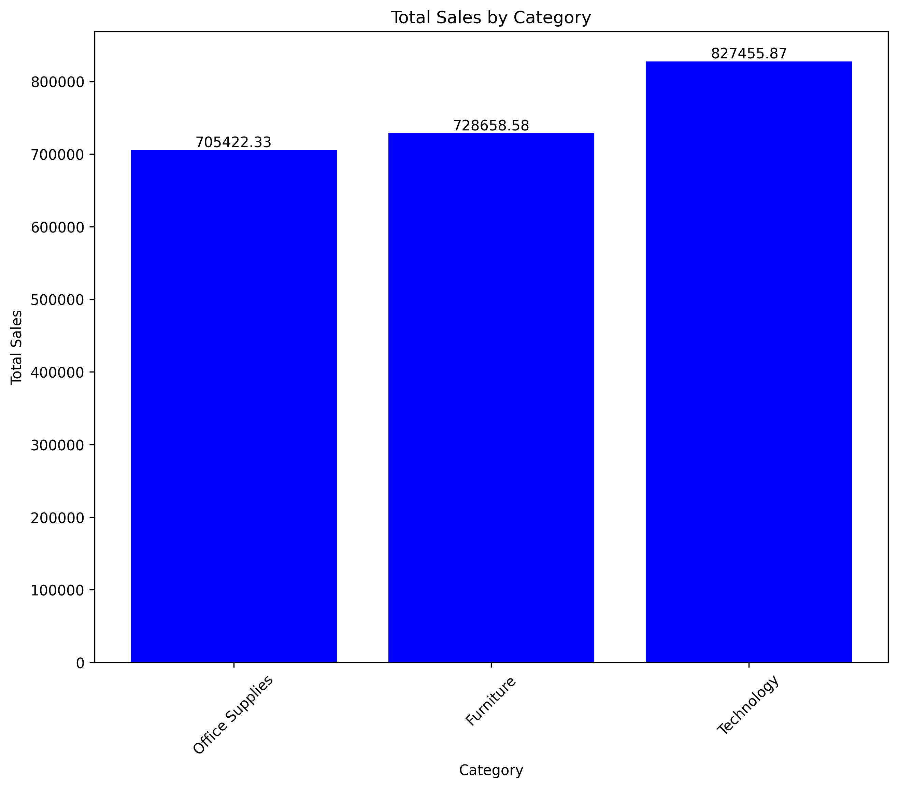
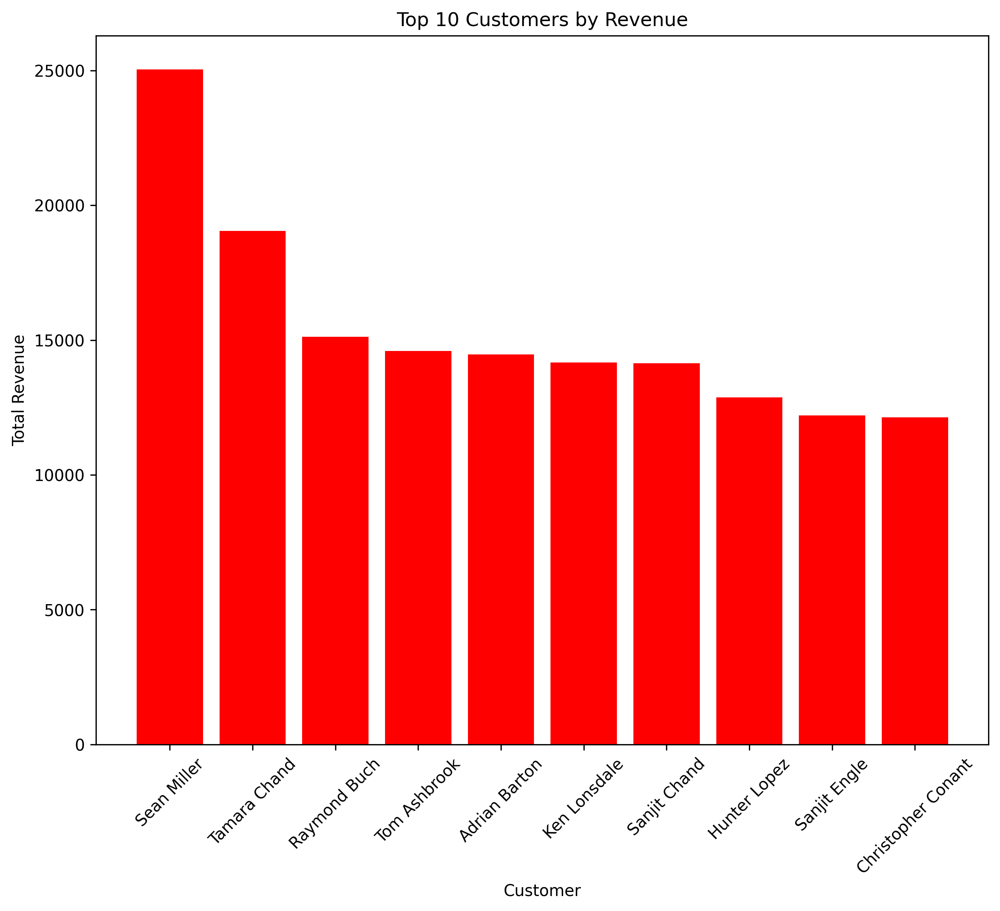
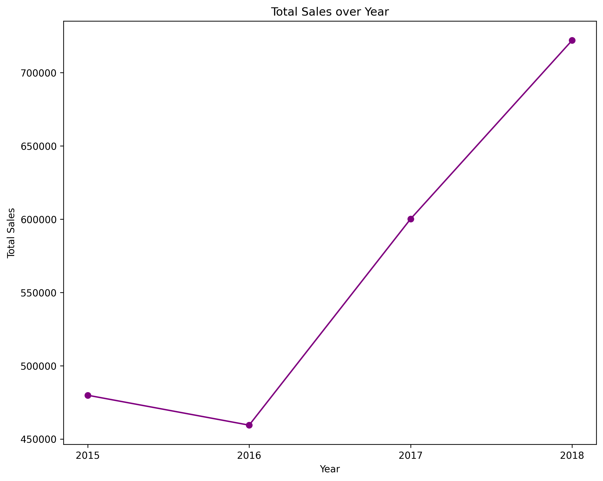

# Sales Data Analysis of Superstore with Pandas and Matplotlib

## 📊 Project Overview
This project explores sales data from a Superstore, with the help of Pandas for data cleaning and analysis, and Matplotlib for visualization. The goal is to uncover insights about Customer behavior, Regional performance, and Product sales.

## 🛠️ Tools & Libraries
- Python (pandas, matplotlib)
- Jupyter Notebook
- Git & GitHub

## 📁 Dataset
- [Superstore Sales Dataset](https://www.kaggle.com/datasets/rohitsahoo/sales-forecasting) — contains sales transactions including order date, ship date, category, sales, region, etc.

## 🔍 Key Insights
- The **West region** has the highest number of Sales.
- **Technology** is the most frequently purchased category.
- **50.5%** increase in Total sales over 3 years.
- **2018** is the most profitable year, constituting **32%** of Total Revenue.
- Most purchased product is **Staple Envelope**.

## 📈 Visualizations

## 🚀 How to Run
1. Clone the repo
2. Install requirements: `pip install -r requirements.txt`
3. Open the notebook: `jupyter notebook notebooks/analysis.ipynb`
